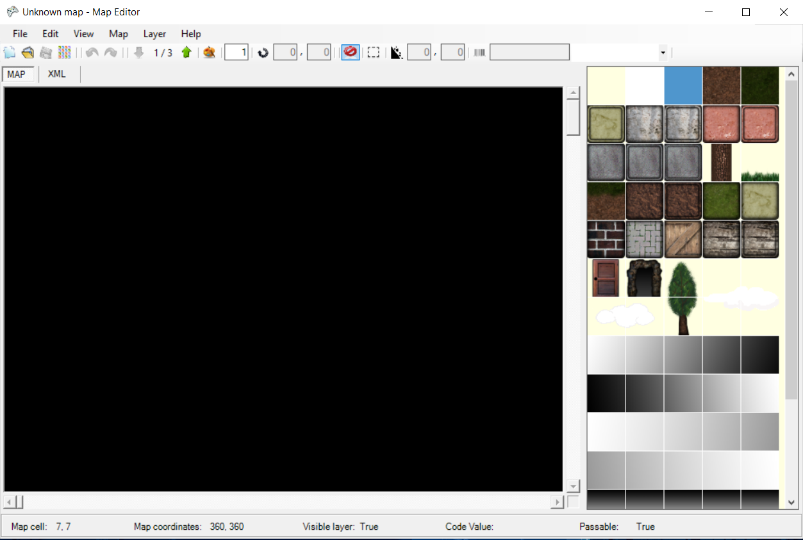
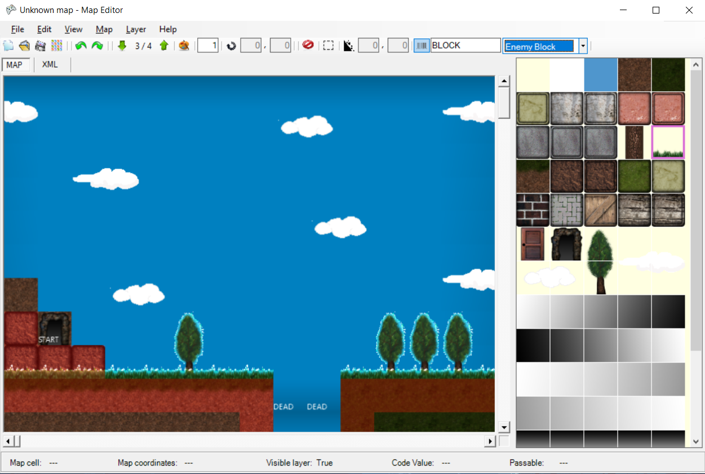
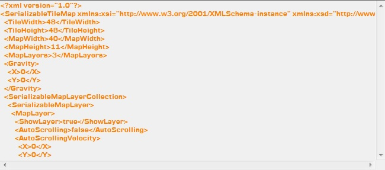

# Tile map editor
This application was created between 2011 and 2012 with the use of XNA framework and Winforms for Windows Vista.  
The application provided an easy and customizable way of creating tile maps for 2D videogames and exporting them in XML format.

You can find more info on the [help file](./docs/help.pdf).

## Screenshots
You can check examples of the application on the [img folder](./img/).

## Try it for yourself
You can try the application by running the *setup.exe* file located on the [installer folder](./installer/).  
This will install the [Microsoft XNA Framework Redistributable 4.0](https://www.microsoft.com/en-us/download/details.aspx?id=27598) and Map Editor on your system.